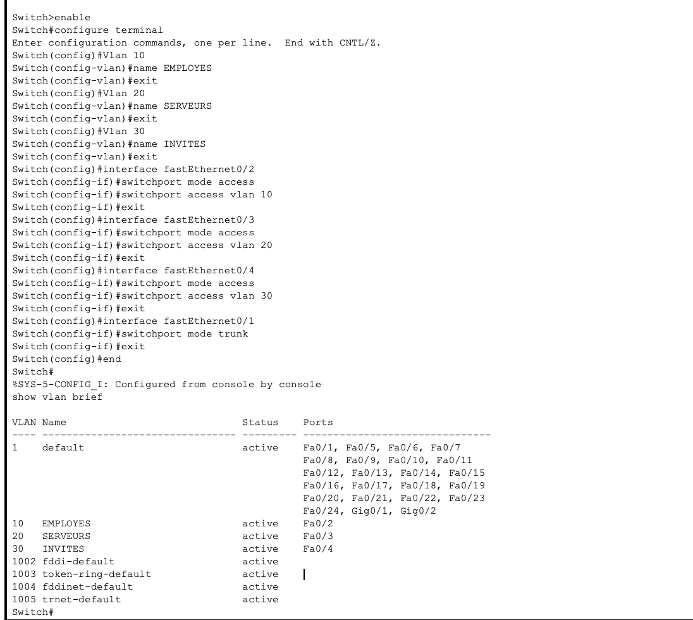
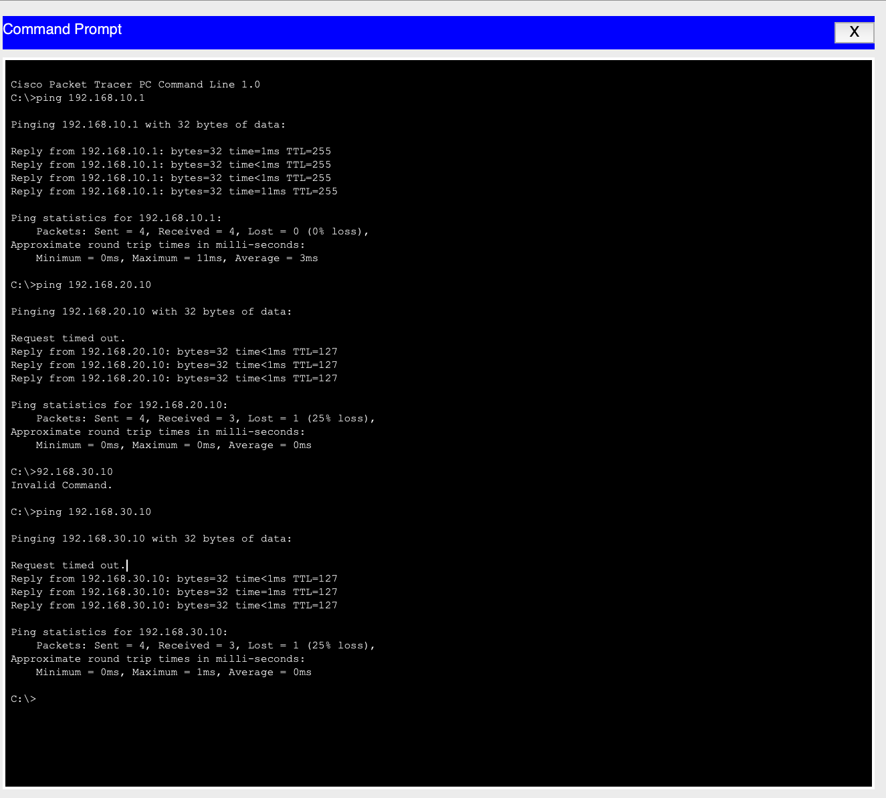
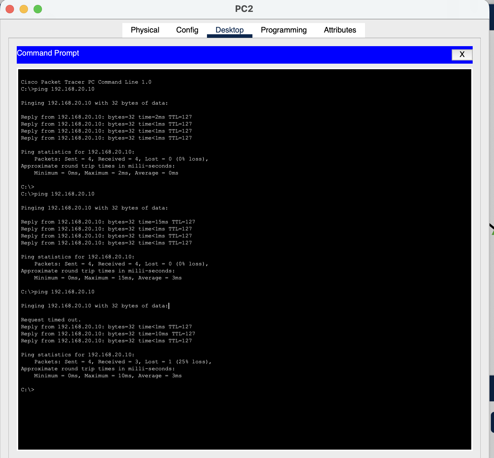
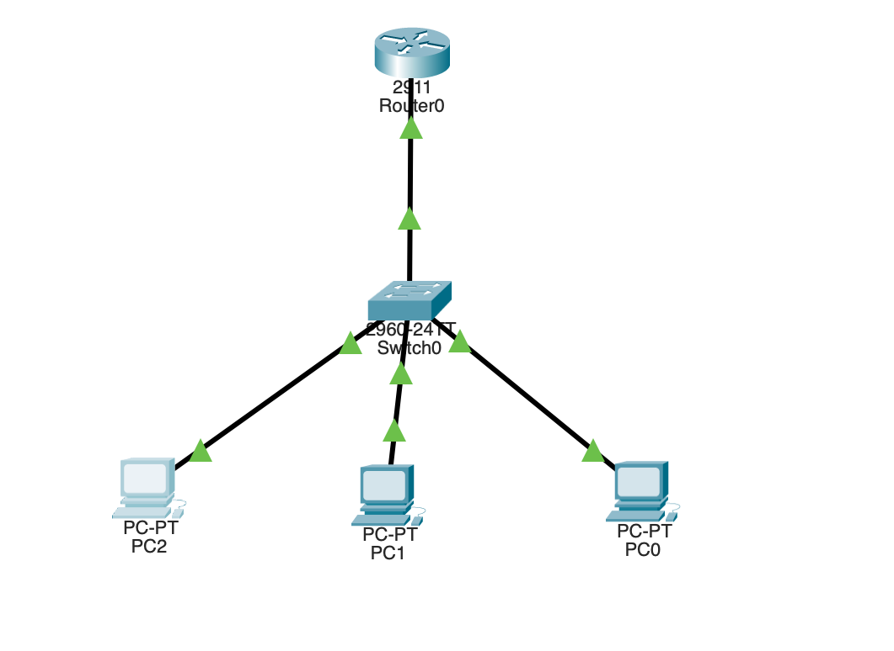

# 🔴 VLAN Lab - Cisco Packet Tracer

**IT Alternance Project**

✅ 3 VLANs (Employees/Servers/Guests)  
✅ Inter-VLAN routing working  
✅ Firewall blocking Guests → Servers  

**Open with Packet Tracer:** Lab-VLAN-Firewall.pkt

  

